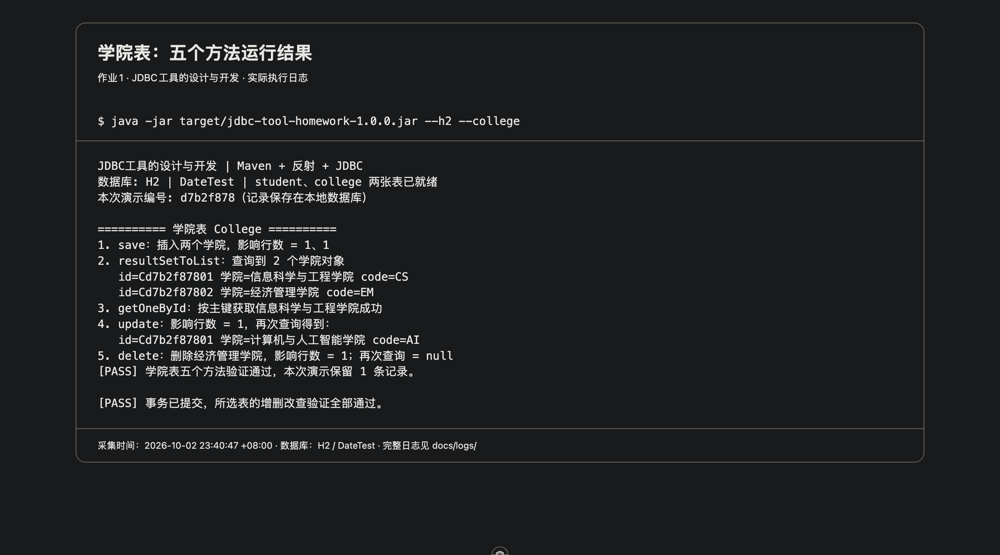
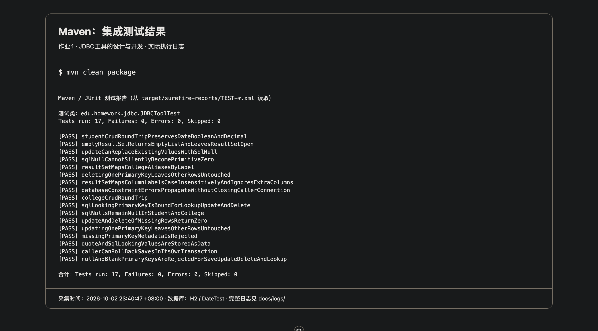

# 作业1：JDBC工具的设计与开发

本项目用 **Java 反射 + JDBC** 实现简单 ORM，没有使用 MyBatis 或 Hibernate。`JDBCTool` 支持将结果集映射为对象列表，以及对学生表、学院表进行增删改查。

题目写了“四个方法”，但列出了五个，本项目按五个方法全部实现。数据库名称严格使用题目的 **DateTest**。

## 快速运行

需要 **JDK 11 或以上、Maven 3.6.3 或以上**。在项目根目录执行：

```bash
mvn clean package
java -jar target/jdbc-tool-homework-1.0.0.jar
```

默认使用真实的 H2 嵌入式文件数据库，自动创建 `data/DateTest.mv.db` 和两张表，无需另行安装数据库服务器。每次演示生成独立编号，插入两条记录、查询、更新其中一条、删除另一条，最后提交事务，保留一条学生和一条学院记录供检查。重复运行会保留不同演示编号的数据。

只查看一张表的演示：

```bash
java -jar target/jdbc-tool-homework-1.0.0.jar --student
java -jar target/jdbc-tool-homework-1.0.0.jar --college
```

## MySQL 运行方式

项目也包含 MySQL JDBC 驱动、配置和建库脚本。如果老师要求 MySQL，先启动自己的 MySQL 服务，在客户端执行 [sql/mysql-init.sql](sql/mysql-init.sql)，再设置连接信息：

```bash
export JDBC_URL='jdbc:mysql://localhost:3306/DateTest?useUnicode=true&characterEncoding=UTF-8&serverTimezone=Asia/Shanghai&allowPublicKeyRetrieval=true'
export JDBC_USER='root'
# 输入你自己的数据库密码；不要把真实密码提交到 Git。
# macOS / Linux：通过隐藏输入设置环境变量。
read -s JDBC_PASSWORD
export JDBC_PASSWORD
java -jar target/jdbc-tool-homework-1.0.0.jar --mysql
```

Windows 可以在 IDE 的运行配置中设置同名环境变量，再传入 `--mysql`。也可以按自己的数据库情况修改 `src/main/resources/db-mysql.properties` 中的连接地址和用户名。当前提交的运行截图及集成测试使用 H2；MySQL 配置已经提供，未宣称完成 MySQL 实机验证。

## 项目结构

```text
jdbc-tool-homework/
├── pom.xml                         Maven 依赖与可执行 JAR 打包配置
├── sql/mysql-init.sql               MySQL 建库建表脚本
├── src/main/java/edu/homework/jdbc/
│   ├── Demo.java                    两张表的五种方法演示
│   ├── annotation/                  表、字段、主键注解
│   ├── entity/Student.java           学生实体
│   ├── entity/College.java           学院实体
│   └── util/                        JDBC工具、连接配置、建表辅助类
├── src/main/resources/              数据库连接配置和公共建表SQL
├── src/test/java/                   真实数据库集成测试
└── docs/                            实现说明、运行日志和截图
```

## 五个方法

所有方法都为 `public static`，以 `SQLException` 向调用者报告数据库及映射错误。

| 方法 | 功能与返回值 |
| --- | --- |
| `<T> List<T> resultSetToList(ResultSet rs, Class<T> clazz)` | 用反射把每一行映射成对象，返回对象列表；无记录时返回空列表 |
| `<T> int save(T obj, Connection connection)` | 根据对象属性生成 INSERT，返回影响行数 |
| `<T> int update(T obj, Connection connection)` | 根据 `@Id` 定位记录，更新非主键属性，返回影响行数 |
| `<T> int delete(T obj, Connection connection)` | 根据 `@Id` 删除对应记录，返回影响行数 |
| `<T> T getOneById(String id, Class<T> clazz, Connection connection)` | 按主键查询一个对象，不存在时返回 `null` |

更新或删除不存在的主键返回 `0`。主键由调用者提供，本作业采用字符串主键，不使用自增主键。更新、删除、按主键查询需要一个 `@Id`；声明了 `@Id` 的对象在保存时也检查主键非空。

## 数据表与对象映射

| 学生字段 | Java 类型 | SQL 类型 |
| --- | --- | --- |
| id | String | VARCHAR(40)，主键 |
| name | String | VARCHAR(80)，非空 |
| major | String | VARCHAR(80) |
| age | Integer | INT |
| enrollment_date（入学时间） | LocalDate | DATE |
| graduated（是否毕业） | Boolean | BOOLEAN |
| tuition（学费） | BigDecimal | DECIMAL(10,2) |

学院表为 `id VARCHAR(40) PRIMARY KEY`、`name VARCHAR(80) NOT NULL`、`code VARCHAR(30)`，三项均对应 Java `String`。

`@Table` 指定表名；`@Column` 处理 `enrollmentDate` 与 `enrollment_date` 的名称差异；`@Id` 指定主键。反射通过无参构造方法创建对象，并读取或赋值私有属性。查询列标签支持大小写和字段别名；查询中的额外列会被忽略。SQL NULL 使用包装类型保存，不能映射为基本类型。

SQL 的值统一使用 `PreparedStatement` 的 `?` 参数，表名、列名来自映射并验证格式。工具关闭自己创建的语句和结果集；传入的连接和结果集由调用者关闭。事务也由调用者控制，演示程序遇到错误会回滚。

更详细的原理及答辩问答见 [docs/实现说明.md](docs/实现说明.md)。

## 验证与运行截图

```bash
mvn test
```

测试使用独立的真实 H2 内存数据库，覆盖两张表的 CRUD、类型映射、SQL 参数、主键范围、错误传播及资源管理。实际结果见 [验证记录](docs/验证记录.md)。

以下是执行日志页面的浏览器截图，日志由真实 Java 进程产生，完整原文保存在 `docs/logs/`。






## Git 版本管理

仓库：[https://github.com/Nolkee/jdbc-tool-homework](https://github.com/Nolkee/jdbc-tool-homework)

```bash
git clone https://github.com/Nolkee/jdbc-tool-homework.git
cd jdbc-tool-homework
git log --oneline
```

数据库文件、构建输出、IDE 配置及本地密码文件由 `.gitignore` 排除。答案区可使用 [提交答案.md](提交答案.md) 中的文字，并上传 `docs/screenshots/` 下的三张截图。

参考资料：[H2 官方数据库文档](https://h2database.com/html/features.html)、[MySQL Connector/J 官方文档](https://dev.mysql.com/doc/connector-j/en/connector-j-usagenotes-basic.html)。
