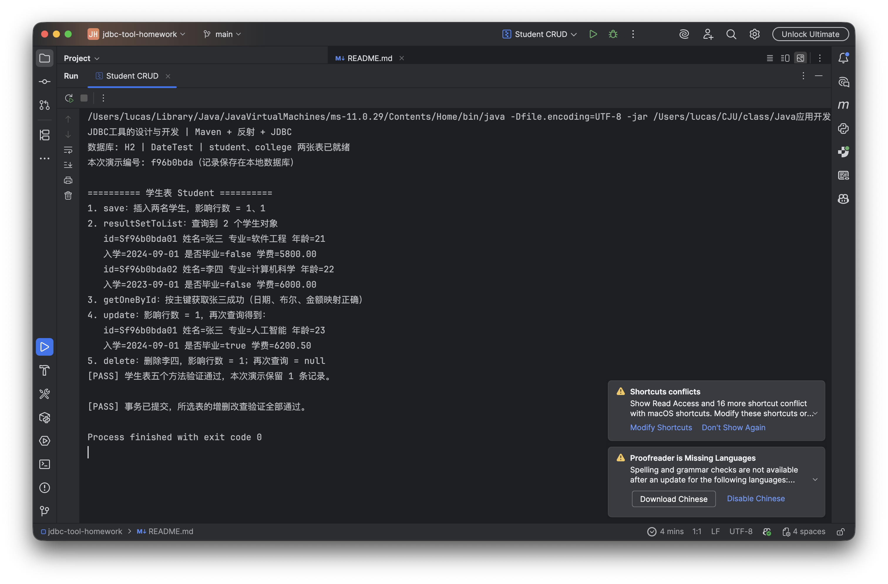
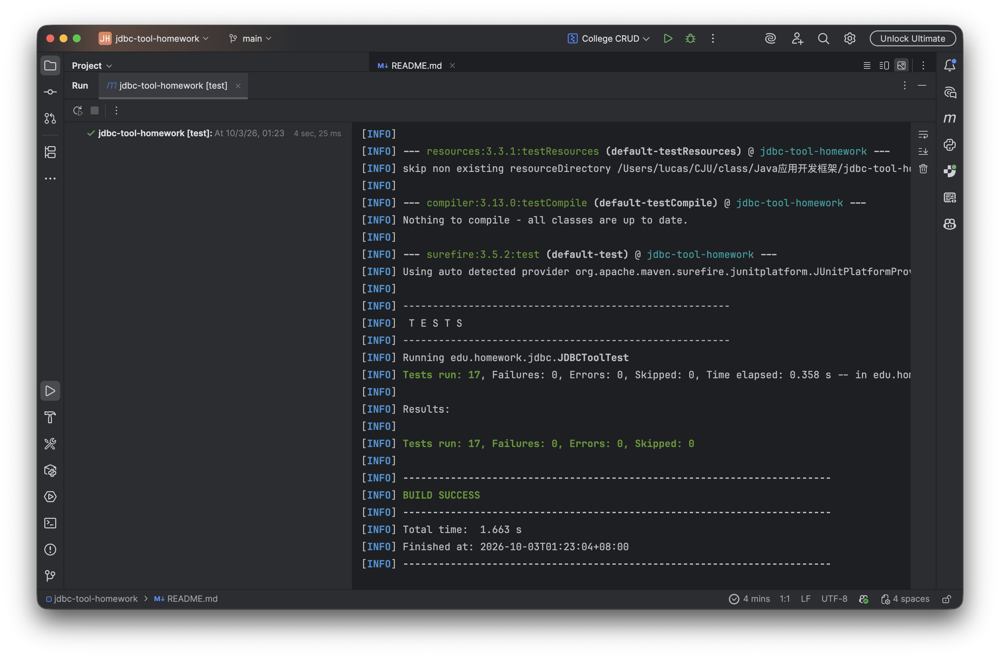

# 作业1：JDBC工具的设计与开发

仓库 URL：[https://github.com/Nolkee/jdbc-tool-homework](https://github.com/Nolkee/jdbc-tool-homework)

本项目使用 Maven 构建，使用 Git 进行版本管理，通过 Java 反射与 JDBC 实现简单的对象关系映射。已完成 `JDBCTool` 的五个泛型方法：`resultSetToList`、`save`、`update`、`delete`、`getOneById`，以及数据库连接、表结构初始化、属性映射和类型转换等辅助方法。

数据库名称为 `DateTest`，包含学生表 `student` 和学院表 `college`。学生表具有 id、name、major、age、入学日期、是否毕业和学费七个字段；学院表具有 id、name、code 三个字段。项目通过 `@Table`、`@Column`、`@Id` 建立实体与数据库表之间的映射，利用反射创建对象并赋值，使用 `PreparedStatement` 参数执行增删改查。

两张表均已实际演示插入、结果集转换、按主键查询、更新和删除操作。运行结果中，每次插入、更新或删除单条记录的影响行数均为 1，删除后再次查询返回 `null`。项目在 JDK 11 下构建成功，17 项数据库集成测试全部通过。

本次运行使用真实 H2 数据库，数据保存在 `DateTest` 文件库中。项目同时提供 MySQL 驱动、配置及 SQL 建库脚本，可按实际环境切换。

以下截图均为 IntelliJ IDEA 中实际运行的窗口截图。

## 运行效果截图

### 1. 学生表五种访问方法

### 2. 学院表五种访问方法

### 3. Maven / JUnit 测试结果

---

提交时复制以上说明和仓库链接到答案区，并上传三张 PNG 截图。截图文件在项目的 `docs/screenshots/` 目录；完整代码、建表脚本和运行说明均在仓库内。
